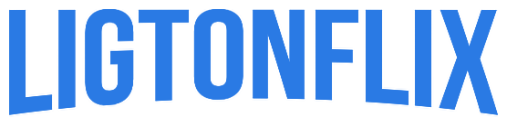

# Ligtonflix


<p align="center">
  
</p>

> Projeto construido durante a [Imersão React da Alura](https://www.alura.com.br/imersao-react/)

Após baixar o projeto, acesse ele via seu terminal rode os comandos:

```sh
npm install
npm start
```
## License/Licença do Projeto
[MIT License](./LICENSE) © [Alura](http://alura.com.br/)
